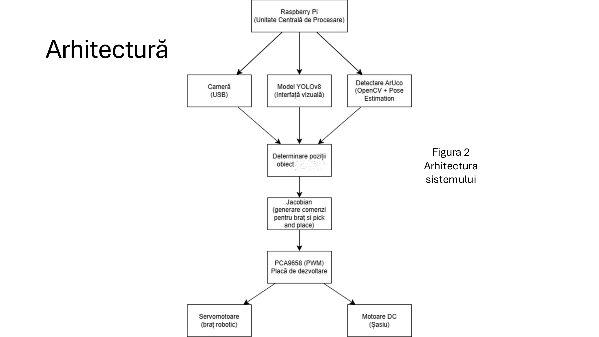
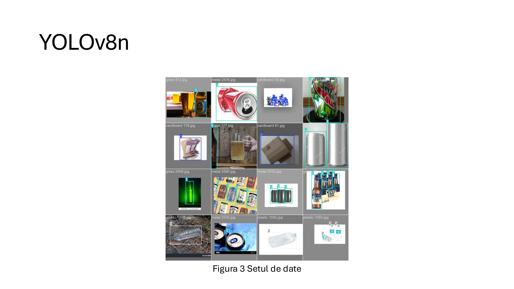
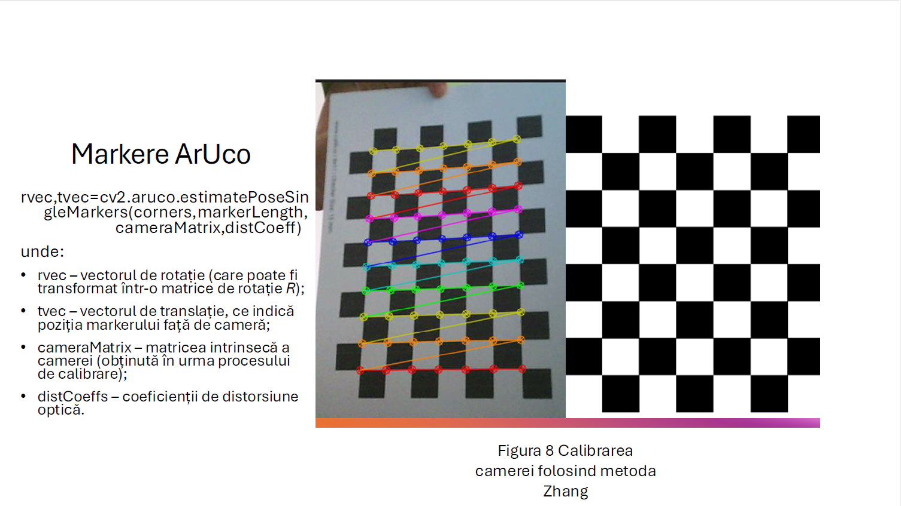
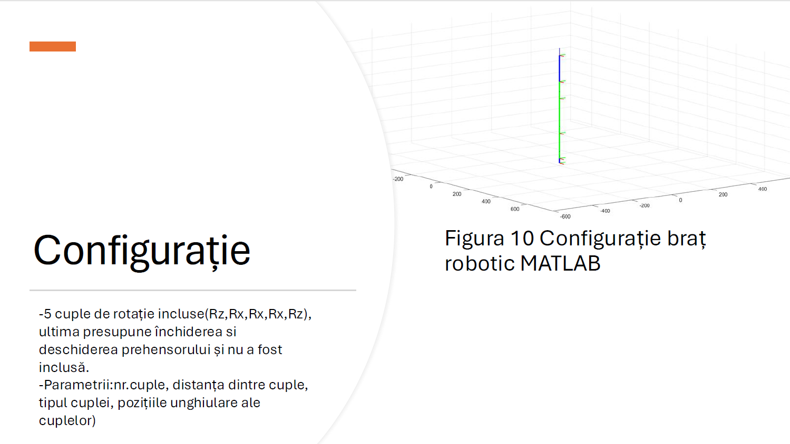

# Robotic Arm for Recyclable Waste Sorting

A mobile robotic system capable of detecting and sorting recyclable waste using YOLOv8, ArUco markers, and inverse kinematics.

## System Overview

## Object Detection

## Camera Calibration

## MATLAB Simulation

## Technologies
- Raspberry Pi 5
- Python
- OpenCV
- YOLOv8
- MATLAB
- ArUco Markers
